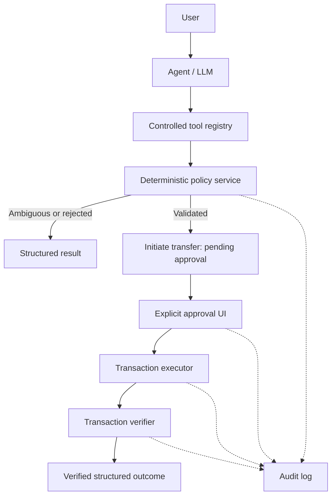

```mermaid
flowchart TD
  U[User] --> A[Agent / LLM]
  A --> T[Controlled tool registry]
  T --> P[Deterministic policy service]
  P -->|Ambiguous or rejected| R[Structured result]
  P -->|Validated| I[Initiate transfer: pending approval]
  I --> H[Explicit approval UI]
  H --> E[Transaction executor]
  E --> V[Transaction verifier]
  V --> O[Verified structured outcome]
  P -.-> L[Audit log]
  H -.-> L
  E -.-> L
  V -.-> L
```

The model can initiate but cannot execute a transfer. The approval endpoint is a separate application-controlled path to the mock executor.
